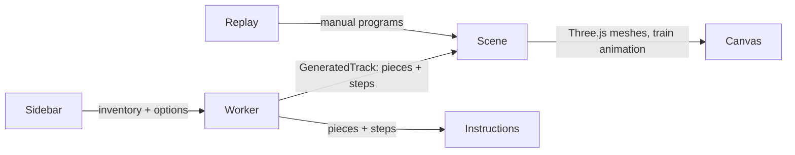

# Architecture

Rail Cube Auto-Generator is a fully client-side SPA: Vite + TypeScript, Three.js for
rendering, Tailwind for styling, Vitest for tests. No server-side code. The heavy search
runs in a Web Worker.



## Layers

### `src/core` — pure model (no DOM, no Three.js)

The physical set's defining property is that the magnetic train rides rails facing **up,
down, or sideways**. Therefore a track state is not just position + heading:

```49:52:src/core/pieces.ts
export interface TrackState {
    cell: Vec3;
    dir: Vec3;
    up: Vec3;
```

- **`vec.ts`** — axis-aligned integer vector helpers. `v()` normalizes `-0` so structural
  equality stays clean (cross products of axis vectors can produce it).
- **`pieces.ts`** — the seven piece types and `computePlacement(type, entry) →
  PiecePlacement`, which returns solid `cells`, `swing` cells, and the `exit` TrackState.
  This is the single source of truth for piece geometry; tests, generator, renderer, and
  the train's rail path all derive from it. Multi-cell pieces (curves, inner, cross) own
  their full footprint. `Inventory` pools `curveLeft`/`curveRight` into one physical part.
- **`grid.ts`** (`OccupancyGrid`) — solid cells (unique) and swing cells (refcounted).
  A solid may not overlap any solid or swing; swings may overlap each other (two rails can
  face each other across a slot). Floor at `y ≥ 0`. Cells are keyed by packed integers
  (not strings) — this is the generator's hottest path.
- **`generator.ts`** — seeded backtracking (mulberry32) over TrackState space. Weighted
  random candidate order (`elevation` shifts weight to/from inner/outer), Manhattan
  pruning against the remaining piece budget plus an exact orientation lower bound (the
  word metric over the 24 orientations, BFS-precomputed at module load), a head-home
  candidate ordering when the budget gets tight, cross route-2 handled as a special "pass
  through occupied cell" step with a once-per-cross rule. `crossMode` governs the purple
  crosses: `'off'` never places them, `'straight'` places them as 2-unit straights (an
  opportunistic route-2 pass is still taken if the loop happens to line one up), and
  `'crossing'` refuses to close until every placed cross has been re-crossed via route 2
  (≥ 1 cross). Crossing search treats the owed pass as a waypoint: the distance prune
  charges the state → route-2 → home detour (plus slack for the piece-free pass moves),
  homing targets the two free approach cells beside the marked "2" cell (never the solid
  cell itself), and a mild gravity weight bends the wander back toward them.
  `generateTrack()` retries derived seeds on an **escalating budget schedule**
  (40×15k → 20×60k → 8×250k → 6×1M nodes): backtracking runtimes are heavy-tailed, so many
  cheap seeds beat a few expensive ones. Crossing mode uses a restart-heavier schedule
  (80×25k → …) because figure-8 seeds either close fast or not at all. Passing an explicit
  `maxNodes` (tests) keeps the old fixed-budget behavior.
- **`score.ts`** — pure aesthetic score for a finished track, modeled on what the manual's
  showcase layouts have: compact interlocked bounding box, overpass columns (same x,z at
  2+ heights), distinct levels, wall/ceiling riding, piece-mix entropy, figure-8 passes,
  minus a penalty for straight runs past 3. Only compared between candidates generated
  with the same settings.
- **`generator.worker.ts`** — message wrapper so search never blocks the UI. If extreme
  settings fail the full schedule, it retries once with softened constraints
  (`minPieces × 0.6`, `elevation × 0.8`), then — for crossing mode — falls back to
  `'straight'` crosses, flagging the response `relaxed` with a `note` so the UI can say
  what happened rather than surfacing a failure. `style: 'showcase'` ("Interesting mode"
  in the UI) instead generates fresh candidates until ~15 s or 8 successes, scores each
  with `score.ts`, and returns the winner.
- **`replay.ts`** — interprets a fixed program (the manual's printed sequences) into placed
  geometry; used by tests, the app's default view, and the console dev hook.
- **`examples.ts`** — ground-truth programs transcribed from the printed manual
  (slotted frame, S-course).

### `src/view` — Three.js

- **`meshes.ts`** — every piece is built in a **local frame** (entry cell centered at the
  origin, travel +X, rail normal +Y) with real proportions: groove floor at 0.38, shoulders
  at 0.48, groove width 0.32. Curves and inner/outer pieces are extruded 2D profiles.
  `placementMatrix()` maps the local frame to world via the basis `(dir, up, dir×up)`, so
  the same mesh serves all 24 orientations — no per-orientation mesh hacks (this replaced
  the old scale-flip approach that double-inverted the Down block). Multi-cell pieces are
  scaled ~2% in about their footprint center (`SEAM`) so chained pieces show a seam instead
  of merging into one solid. Support holes (round) are placed one per solid cell per flat
  face, matching the physical pieces. Face decals (holes, sockets) go through one helper
  (`faceDisc`) that takes a point **on** the face plus its outward normal and guarantees a
  fixed `DECAL_PROUD` protrusion — hand-tuned per-call offsets are how decals end up
  coplanar with the face (z-fighting flicker) or buried (invisible). Metal strip end caps
  are likewise inset a hair from piece faces. Steel strips sit 0.03 below the shoulder tops
  and nearly fill the groove, like the photos. Blue/green curves are fully double-sided
  (shoulders, strip, and holes mirrored on both faces — the piece is flippable). The START
  sticker is a single capsule on one shoulder with a drawn arrow (not a font glyph)
  pointing at the exit face.
  Also: rail-path samplers per piece (used by the train), the train itself, support pillars.
- **`scene.ts`** (`SceneController`) — lights/shadows plus a `RoomEnvironment` map (for the
  steel), a camera-tracking fill light (a fixed sun leaves whatever face you orbit toward on
  its dark side; the fill sits over the viewer's shoulder — off-axis, so pieces still shade
  rather than flatten. It needs no dimming logic because the sunlit side already renders at
  full brightness, so the extra light only registers where the sun doesn't reach. Note that
  a light parented to the camera is *not* picked up by the renderer's light list, so it
  lives in the scene and is re-aimed each frame), ground plane at the cell bottom
  (y = −0.5), auto camera framing from the −X/+Z
  quadrant (so the start cube reads as pointing right), train animation along an
  **arc-length parameterized rail path** built from the traversal steps (constant speed
  through curves and vertical segments), minimal support pillars (a piece anchors a run if
  it touches the ground or another cell; every third consecutive floating piece gets one
  pillar, keeping train swing cells and down-facing rails clear), and `captureThumbnail()`
  for favorite snapshots. Auto-framing is viewport-aware: the camera distance is solved from
  the projected track bounds (the horizontal field of view is the tight constraint on a
  portrait phone) and the view angle steepens as the canvas narrows, since a flat track
  foreshortens into a thin band from a low angle. A `ResizeObserver` re-frames on rotation,
  except once the user has orbited by hand — then it only pulls back far enough to avoid
  cropping.

### `src/ui` — DOM

- **`sidebar.ts`** — kit selector (Starter / Deluxe / Custom), a Simple/Advanced mode
  toggle (Simple: one 1–5 complexity dial mapped to size = 10..whole-kit and elevation =
  0..0.9; Advanced: separate track-size and elevation sliders), a cross-pieces checkbox
  with a Straight ×2 / Crossing style toggle (disabled with a hint when the kit has no
  crosses; `getState()` reports `'off'` whenever the inventory can't honor it), an
  Interesting-mode checkbox (`style: 'showcase'`), save-to-favorites button,
  live used/total inventory after each generation. All selections persist to localStorage
  (`railcube.settings.v1`) and are restored on load, with validation of stored values.
- **`instructions.ts`** — assembly-program chips in traversal order (START, L/R on curves,
  numbered cross routes), piece-count summary, print button. `@media print` in
  `style.css` shows only this panel.
- **`favorites.ts`** — favorite tracks persisted to localStorage. Placements and steps are
  plain JSON (no class instances), so a saved track round-trips exactly and re-renders
  without re-running the generator. Thumbnails come from `captureThumbnail()`; capped at
  12 entries with quota fallback.
- **App shell** — `#layout` is a CSS grid whose named areas are re-assigned at the 768px
  breakpoint, so one markup tree serves both forms: phones get the 3D view on top, a tab bar,
  and a sheet holding *one* of the two panes (`body[data-pane]` picks which); wider screens
  get the controls column on the left with the view above the steps panel. Placing by area
  rather than DOM order keeps the print flow (snapshot then program) intact, and the print
  rules force the program visible even when the phone sheet is showing Controls.
- **`main.ts`** — wiring, plus failure paths: worker `onerror` resets the loading state
  with a toast, and if WebGL can't start the app degrades to instructions-only with a
  message in place of the viewport. The last displayed track is restored from localStorage
  on load (`lastTrack.ts`). On `beforeprint`, a JPEG snapshot of the viewport is injected
  so the printed page includes the 3D view (WebGL canvases often print blank).
- **`lastTrack.ts`** — save/load the current track to `railcube.lastTrack.v1`.

## Key design decisions

1. **The model was rewritten from the physical manual, not the old code.** Reference
   photos in `references/` established that blue/green is one flippable 2×2×1 piece, the
   orange inner curve is a 2×2×1 wedge (two form a slot end), the red outer curve is a
   convex 1×1 wrap, and the purple cross is 2×1×1 traversed twice. Ground-truth manual
   programs (`examples.ts`) are replayed as tests, so the model can't silently drift from
   the toy.
2. **State carries the rail normal.** `dir` alone can't describe riding a wall or hanging;
   `up` (rail normal) also determines where the train body sweeps (swing cells) and which
   orientations are legal for the next piece.
3. **Swing cells are shareable, solids are not.** This single rule makes the manual's
   slotted frame constructible while still blocking real collisions, including "train runs
   into a cube face".
4. **Single source of geometry truth.** The generator, tests, meshes, train path, and
   instructions all consume `PiecePlacement`; there is no second geometry code path.
5. **Seeded RNG + attempts loop.** Deterministic, testable generation; the worker just
   retries new seeds until the backtracker closes a loop, reporting progress.
6. **TDD with ground truth.** Unit tests for transforms, replay tests against the printed
   manual, and property tests that re-validate every generated track from scratch
   (placement legality, chain continuity, closure, floor, inventory).

## Known limitations

- Crossing mode is a closure *requirement*, not a plan: forward search still can't plan a
  route-2 loop, so the waypoint pruning/homing only steer toward one. At extreme settings
  (long + very vertical) figure-8s sometimes don't close within the schedule; the worker's
  fallback chain (soften, then straight crosses) covers this.
- Showcase scoring is selection-only — it never changes the search itself, just picks the
  best of several finished candidates.
- Support pillars are decorative; their count isn't part of the search objective. The
  placement heuristic is intentionally minimal — connectors hold short spans on the toy.
- "Rail Cube Action" add-on parts (slopes, spinners) are not modeled.
