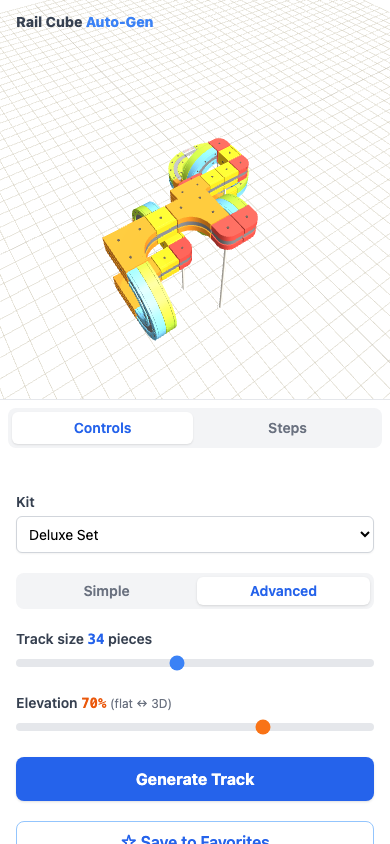
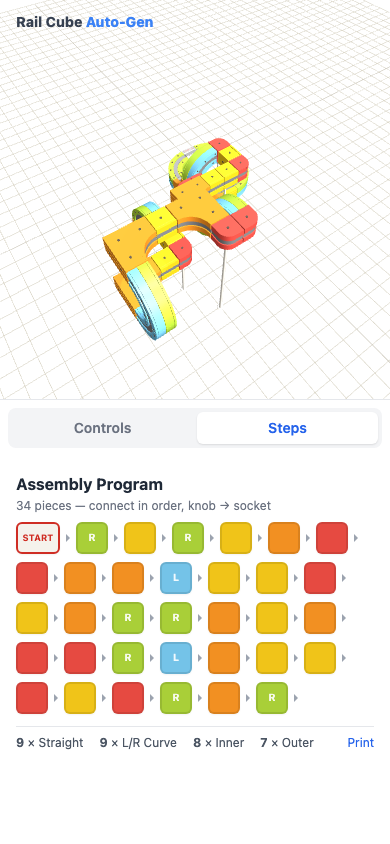

# Rail Cube Auto-Generator

**Try it live:** [https://tanvach.github.io/RailCubeAutoGen/](https://tanvach.github.io/RailCubeAutoGen/)

A client-side web app that procedurally generates **valid, closed 3D track loops** for the
[Rail Cube](https://www.railcubetoys.com) magnetic monorail cube set (SunSmile レールキューブ),
renders them in Three.js with an animated train, and prints "program note" style assembly
instructions (the color sequence used by the physical set's programming practice sheets).

Curious how it finds those loops? **[How It Works](docs/HOW_IT_WORKS.md)** is a deep dive
into the solver — a randomized backtracking search over a 3D grid of oriented frames, and
the five heuristics (admissible pruning, weighted ordering, a homing phase, heavy-tail
restarts, graceful relaxation) that make it feel instant — plus the rendering pipeline that
turns integer cells into a lit, animated scene.


## Quickstart

```bash
npm install
npm run dev
```

Open the printed URL, press **Generate Track**. The app opens with your last generated
track (or a course from the printed manual on a first visit).

## Deployed site

The production build is published to GitHub Pages on every push to `main`:

**https://tanvach.github.io/RailCubeAutoGen/**

No install needed — share that link with anyone who has a browser.

## Scripts

| Command | Purpose |
| --- | --- |
| `npm run dev` | Vite dev server |
| `npm test` | Vitest suite (model, generator, UI) |
| `npm run build` | Type-check + production build into `dist/` |
| `npm run preview` | Serve the production build on port 4173 |
| `node scripts/screenshot.mjs [outDir]` | Headless visual check: screenshots the default course, the manual example, generated tracks, the mobile portrait shell, and the print view (requires `npm run preview` running) |
| `npx vite-node scripts/bench-generator.ts` | Generator wall-time benchmark across realistic settings |

## The piece model

The train is magnetic and rides rails facing **up, down, or sideways**, so a track state is a
grid cell plus two orthogonal unit vectors: travel `dir` and rail-face normal `up`. Piece
geometry was derived from the printed manual and piece photos in `references/`:

| Piece | Color | Footprint | Behavior |
| --- | --- | --- | --- |
| Start | white | 1×1×1 | Straight-through; powers the loop; the loop must close back into it |
| Straight | yellow | 1×1×1 | Continues in `dir` |
| L/R Curve | blue / green | 2×2×1 | 90° in-plane turn (quarter annulus). Blue face up = left, green = right — same physical part flipped |
| Inner Curve | orange | 2×2×1 | Concave 90° turn out of the rail plane (e.g. floor → wall); two stacked form a semicircular slot end |
| Outer Curve | red | 1×1×1 | Convex 90° wrap around the cube edge |
| Cross | purple | 2×1×1 | Two crossing rails; traversed twice per loop (routes numbered 1 and 2 on the toy) |

**Inventories** (from the manual): Starter = 15 straight / 8 curve / 4 inner / 4 outer;
Deluxe = 31 / 16 / 8 / 8 / 2 cross. A Custom Inventory editor is also available.

Placement rules enforced by the model:

- Solid cells may never overlap other solids or any piece's **swing cells** (the space the
  train sweeps through).
- Swing cells may be *shared* between pieces — that's how two rails can face each other
  across a narrow slot, as in the manual's frame example.
- Everything stays at `y ≥ 0` (the floor).
- Each cross piece's route 2 may be used at most once.

## Features

- **Generator** — seeded backtracking search (runs in a Web Worker) with weighted-random
  piece selection, an elevation dial (flat ↔ vertical), Manhattan-distance and exact
  orientation-distance pruning, and a head-home bias when the piece budget runs low.
  Deterministic per seed. Restarts follow an
  escalating budget schedule (many cheap seeds first — backtracking runtimes are heavy-
  tailed), and if extreme settings can't close, the worker relaxes them slightly once
  instead of failing. The full story, with the math behind each heuristic, is in
  [How It Works](docs/HOW_IT_WORKS.md).
- **3D viewport** — faithful piece meshes (near-flush steel rail strips, two-tone curves
  with grooves on both faces, concave/convex wedge profiles, connector knobs), minimal
  support pillars (only under long floating runs), OrbitControls, and an animated train that
  follows the exact rail path — including riding walls and hanging upside down. A fill light
  tracks the camera, so spinning round to the back of a track keeps the piece colors
  readable instead of leaving them in the sun's shade.
- **Assembly program** — color-sequence chips in build order matching the manual's notation
  (START, L/R on curves, numbered cross routes), piece-count summary, live "used / total"
  inventory, and a print layout that includes both a 3D snapshot and the assembly program.
- **Favorites** — save any track (generated, replayed, or loaded) with a rendered thumbnail
  to localStorage, and restore it later with one click.
- **Sticky session** — kit, sliders, mode, and the last displayed track all persist across
  browser refreshes.
- **Simple / Advanced controls** — Advanced exposes track size and elevation separately;
  Simple is one five-notch complexity dial (Cozy loop → Wild) that sets both. A "Show train"
  toggle hides the train when it's distracting.
- **Works on a phone** — on narrow screens the 3D view sits on top and a tabbed sheet
  switches between Controls and Steps, so neither is cramped. The camera framing accounts
  for the viewport shape and re-frames on rotation, so a track is never cropped.

<p align="center">
  
  
</p>


*The manual's slotted-frame example (START + 15 straights + 4 inner curves) replayed by the
app — the train loops through the vertical slot. This and the S-course are ground-truth
test fixtures in `src/core/pieces.test.ts`.*

## Verifying against the physical set

A dev hook is exposed in the browser console:

```js
window.__railcube.renderProgram(['start', 'straight', 'straight', 'curveLeft', 'straight'])
```

Type in any program from the manual's practice sheet (piece types: `start`, `straight`,
`curveLeft`, `curveRight`, `inner`, `outer`, `cross`, plus `'crossPass'` for route 2 of a
cross) and it renders the result, returning `{ closed, error }`.

## Project structure

```
src/
  core/            Pure TypeScript model — no DOM, no Three.js
    vec.ts         Integer vector math (axis-aligned only)
    pieces.ts      Piece types, footprints, exit-state transforms, inventories
    grid.ts        Occupancy grid (solid cells + shared swing cells, floor)
    generator.ts   Seeded backtracking loop generator
    replay.ts      Interpret a fixed piece program into placed geometry
    examples.ts    Ground-truth programs transcribed from the printed manual
    generator.worker.ts  Web Worker wrapper (keeps generation off the UI thread)
  view/
    meshes.ts      Procedural piece meshes + rail path samplers + train + pillars
    scene.ts       SceneController: lights, ground, camera fitting, train animation
  ui/
    sidebar.ts     Kit/custom inventory, size & elevation controls, usage display
    instructions.ts Assembly-program chips and piece counts
    favorites.ts   Saved tracks with thumbnails (localStorage)
scripts/
  screenshot.mjs   Headless visual regression/screenshot tool (Playwright)
references/        Photos of the physical pieces and the printed Japanese manual
docs/
  HOW_IT_WORKS.md  Deep dive: the solver, its heuristics, and the rendering pipeline
  images/          Rendered verification screenshots
```

## Testing

`npm test` runs three suites:

- **`pieces`** — transform/unit checks plus **ground-truth replays of the manual's printed
  examples** (slotted frame, S-course, and a synthetic cross figure-eight); collision and
  floor constraint rejection.
- **`generator`** — property tests: every generated track is re-validated from scratch
  (placement legality, chain continuity, loop closure, floor, inventory limits) across many
  seeds; determinism per seed.
- **`ui`** — sidebar state flow and instructions rendering.

## Known simplifications

- The generator deliberately never places **cross** pieces: a cross is only purposeful when
  the loop re-crosses it via route 2, which forward search can't plan for, so generated
  crosses were just confusing straight-substitutes. Cross pieces remain fully supported in
  replayed manual programs, favorites, and the assembly instructions.
- Support pillars are visual only. Placement is heuristic: pieces resting on the ground or
  on other pieces count as anchored, and every third consecutive floating piece gets one
  pillar (connectors hold short spans on the real toy).
- Track curvature radius matches the starter/deluxe pieces; the "Rail Cube Action" add-on
  parts (slopes, spinners) from the manual's contents page are not modeled.

See [docs/HOW_IT_WORKS.md](docs/HOW_IT_WORKS.md) for a deep dive into the solver and
renderer, [ARCHITECTURE.md](ARCHITECTURE.md) for design decisions, and [SPEC.md](SPEC.md)
for the original brief.
