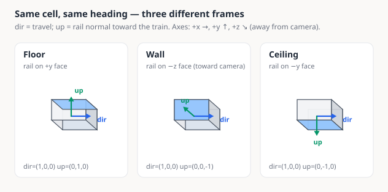
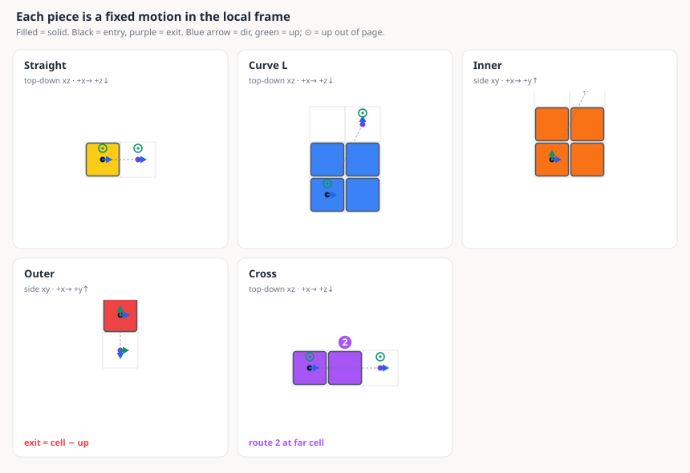
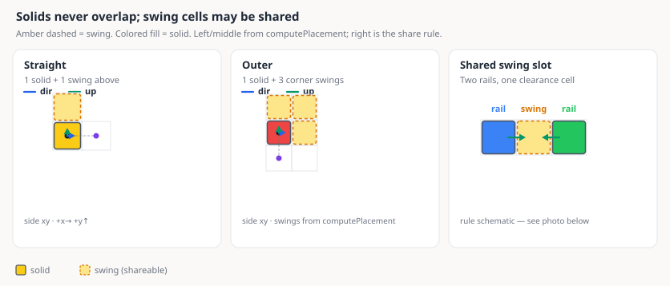
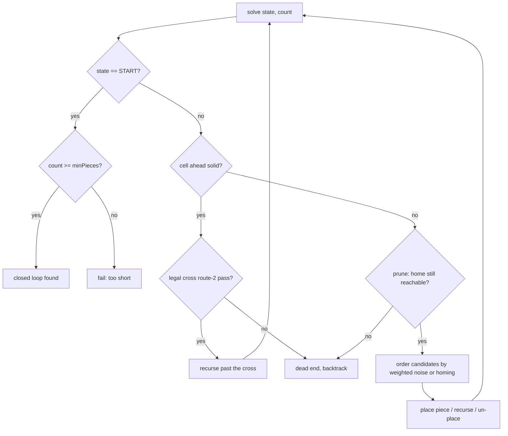
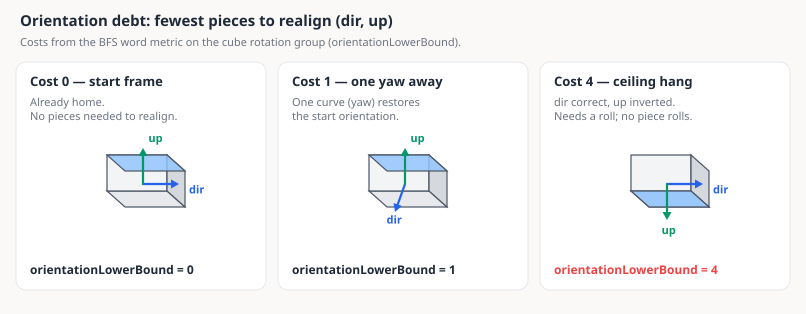

# How It Works

*How the [Rail Cube track generator](https://tanvach.github.io/RailCubeAutoGen/) finds closed
loops, and how it draws them. Written for people who build software. Undergrad math is
enough, and no Three.js or search-algorithm background is assumed.*

---

## Contents

1. [The toy and the problem](#1-the-toy-and-the-problem)
2. [What a track state has to remember](#2-what-a-track-state-has-to-remember)
3. [Pieces as rigid motions](#3-pieces-as-rigid-motions)
4. [What makes a track valid](#4-what-makes-a-track-valid)
5. [The solver: randomized backtracking](#5-the-solver-randomized-backtracking)
6. [Five heuristics](#6-five-heuristics)
7. [Interlude: how many tracks are there?](#7-interlude-how-many-tracks-are-there)
8. [Rendering: from integer cells to a lit scene](#8-rendering-from-integer-cells-to-a-lit-scene)
9. [How we know it's right](#9-how-we-know-its-right)
10. [Tradeoffs and future work](#10-tradeoffs-and-future-work)
11. [References](#11-references)

---

## 1. The toy and the problem

[Rail Cube](https://www.railcubetoys.com) (SunSmile レールキューブ) is a Japanese construction
toy. The pieces are plastic cubes with steel rail strips set into their faces, and the train
is a small battery-powered car with a magnet underneath. Because it holds on magnetically
rather than by gravity, it will happily ride up a wall, across a ceiling, and back down
again upside down. The manual comes with "programming practice" sheets: rows of colored
squares that a child reads left to right and turns into a physical build.


This project asks whether a computer can invent new courses from the pieces in the box.
Every course begins and ends at the white start cube, so the app has three jobs:

1. Find a sequence of pieces that leaves the white cube and comes back to it exactly —
   same cell, same direction of travel, same orientation. Pieces must not overlap, and must
   not block the space the train needs.
2. Stay inside a real box of pieces. The starter set holds 15 straights, 8 curves, 4 inner
   curves and 4 outer curves; the deluxe set roughly doubles those and adds 2 crosses.
   Eight curves is not many for a shape that has to turn all the way back on itself, so the
   box, not the geometry, is usually what runs out first.
3. Draw the result well enough that a child, or more realistically their parent, can build
   it from the picture and the color sequence.

The first job sounds like path-finding. It is closer to searching for a self-avoiding loop
in a state space where the moves don't commute. Most of what follows is about the handful
of heuristics that usually keep that search under a second (hard deluxe settings can still
take a few). Everything runs in the browser: the solver is dependency-free TypeScript in
`src/core/` with no DOM and no Three.js, and the renderer lives in `src/view/`.

## 2. What a track state has to remember

On an ordinary train set, a track state is a position and a heading. That isn't enough
here. The train can arrive at the same cell going the same way while riding the floor, a
wall, or a ceiling, and a different set of pieces fits in each case.

So a track state is a frame: an integer grid cell plus two orthogonal unit vectors
(`src/core/pieces.ts`).

```ts
interface TrackState {
    cell: Vec3;  // integer grid cell
    dir:  Vec3;  // direction of travel        (axis-aligned unit vector)
    up:   Vec3;  // rail-face normal, pointing from the rail toward the train
}
```



*Same cell and heading, three frames. The blue face is the rail; `dir` is travel, `up` is the
rail-face normal toward the train. Sketch axes: +x right, +y up, +z into depth away from the
camera (down-right). The wall panel uses the −z face so the rail is the visible front.*

`dir` has 6 possible values (±x, ±y, ±z) and `up` has to be perpendicular to it, which
leaves 4 choices, so each cell has 24 orientations. That is exactly the rotation group of
the cube (the chiral octahedral group, isomorphic to S₄). A `(dir, up)` pair is enough for
a full rotation because the third axis is forced: `right = dir × up`. In symbols, the
reachable states are ℤ³ × that 24-element group — a discrete stand-in for the rigid-motion
group SE(3). For the solver, the useful bit is simpler: two visits to the same cell with
the same heading can still need different pieces, so the search state has to carry `up`.

One practical note that saved me a lot of debugging. All the vector math is exact integer
arithmetic: cross products and negations of axis vectors, with no floats, no normalization
and no epsilon comparisons. The one wrinkle is that `-1 * 0` is `-0` in IEEE 754, and `-0`
fails a structural equality check against `0`, so the `Vec3` constructor normalizes `-0`
back to `0` (`src/core/vec.ts`).

## 3. Pieces as rigid motions

Each piece type is a fixed rigid motion applied in the local frame. Enter it in a state
and it deterministically produces the cells it occupies and the exit state. The whole piece
catalog is one `switch` statement (`computePlacement` in `src/core/pieces.ts`).

| Piece | Color | Displacement (local) | Rotation | Cells |
| --- | --- | --- | --- | --- |
| Start / Straight | white / yellow | `+dir` | identity | 1 |
| Curve L/R | blue / green | `dir + 2*side` | 90° yaw about `up` | 4 (2×2 in the rail plane) |
| Inner curve | orange | `dir + 2*up` | 90° pitch: `dir -> up`, `up -> -dir` | 4 (2×2 in the dir/up plane) |
| Outer curve | red | `-up` | 90° pitch: `dir -> -up`, `up -> dir` | 1 |
| Cross | purple | `2*dir` | identity | 2 |

`side` is the direction a flat curve turns toward: `up × dir` for a left curve and
`dir × up` for a right one. Blue and green are the same physical part flipped over, so both
draw from the same pool of curves. The cross is the only piece with two ways through it.
Route 1 runs straight along its long axis (the motion in the table); route 2 crosses
perpendicular through its far cell, so a loop that uses a cross passes over it twice, once
each way. Those numbers are printed on the real part, and the code and the rest of this
document use the same names.



*Footprints and exit frames from `computePlacement`, entered at the start state. Top-down
panels use +x right and +z down the page; side panels use +x right and +y up. Blue arrows
are `dir`, green are `up`; ⊙ means `up` points out of the page. The cross panel draws
route 1; the “2” badge marks where route 2 would cross later.*

Two consequences of that table shape the solver.

First, a track is just a word in these piece letters. Each letter applies a fixed motion to
the current state, and the loop closes only when the product is the identity: back at the
start cell, facing the same way, rail-normal restored. In group-theory language that is a
walk on a Cayley graph that returns to 1. Ride any legal loop and `up` comes back to where
it started — you never have leftover twist to cancel by hand.

Second, the motions do not commute, so you do not get a cheap counting invariant. With
displacement alone you could demand that the x components sum to zero and prune hard. With
orientation in the mix, an inner curve then a yaw is a different state from a yaw then an
inner curve. The only invariants left are the obvious ones — net displacement zero and net
rotation identity — and section 6's pruning uses exactly those. Nothing deeper exists in
closed form.

The `up` vector earns its keep in the piece definitions. The red outer curve occupies one
cell, and its exit is `cell - up`: the train wraps around a cube edge and continues on the
far face of the same cube. A state of (position, heading) alone cannot say that.

## 4. What makes a track valid

Legal geometry is not the same as a legal build. `OccupancyGrid` (`src/core/grid.ts`)
enforces the physical constraints.

Solid cells never overlap other solids. Each piece also declares swing cells, the empty
space the train sweeps through while riding it: the cell above a straight, the four cells
above a flat curve, the corner region outside an outer curve. An inner curve declares none,
because the space it sweeps is the concave notch inside its own body. A solid may never sit
in anyone's swing cell, and no swing cell may open inside a solid.

Two swing cells may overlap each other. That one permission lets two rails face each other
across a single empty cell, each claiming it as clearance. The manual's slotted frame below
is impossible to model without it — something I only got after staring at the printed
manual for too long.



*Left and middle: solid + swing cells from `computePlacement` (outer’s corner swings are
in-plane, so they can actually be drawn). Right: the shareability rule — two rails may both
claim the amber cell — which makes the slotted frame below legal.*


*The manual's slotted frame. The train dives through a vertical slot one cell wide with rail
on both walls, and each wall piece claims the slot as its swing cell. That is legal, because
swing cells are shareable.*

Two more rules: every cell has to stay at `y >= 0` (the floor), and each cross piece may be
traversed by route 2 at most once.

The grid itself is two hash maps. The first implementation keyed them with strings like
`"3,0,-2"`, and profiling showed that building those keys dominated the solver's hot loop,
so cells are now packed into a single integer.

```ts
const B = 512;
const pack = (c: Vec3): number => (c.x + B) + ((c.y + B) << 10) + ((c.z + B) << 20);
```

Ten bits per coordinate, offset to stay positive. Same idea as a Morton code without the
interleaving — we want cheap equality, not spatial locality. That made the collision check,
the most-executed operation in the search, roughly ten times cheaper.

## 5. The solver: randomized backtracking

### Why not something fancier?

The obvious tools miss, for different reasons.

- A\* and Dijkstra find a shortest path to a goal. Shortest is exactly what we don't want:
  a 4-piece loop is legal and boring. We want a loop of roughly a target length, with some
  variety, sampled differently each time you press the button.
- A SAT or CP solver could encode "closed loop, no overlap, inventory within budget", but
  the encoding over an unbounded ℤ³ is awkward, the solver ships megabytes of WASM, and you
  get one canonical answer rather than a stream of varied ones.
- Graph search with a visited set is unsound here. Whether a state is worth revisiting
  depends on everything placed so far — the occupancy grid and the remaining inventory —
  not just on the `(cell, dir, up)` tuple. Two visits to the same state are different search
  nodes. That is why this is backtracking over partial solutions rather than path-finding
  over states, the same reason nobody solves N-queens with Dijkstra.

So the solver (`src/core/generator.ts`) is a depth-first backtracker with the same skeleton
as a Sudoku or N-queens solver.

```
solve(state, pieceCount):
    if state == START_STATE:        return pieceCount >= minPieces      # loop closed
    if cell ahead is occupied:      only a cross route-2 pass can continue
    if provably can't return home:  return false                        # pruning, §6
    for each piece type still in inventory, in weighted-random order:   # ordering, §6
        place it; recurse; on failure, un-place it                      # backtrack
    return false
```

Placing and removing a piece are both O(cells) map operations, so backtracking is cheap. The
RNG is `mulberry32`, a tiny seedable generator, so the search is fully deterministic for a
given seed and settings. That makes failures reproducible and property tests meaningful
(section 9).

Cross pieces are opt-in (`crossMode`), because a cross only earns its keep if the loop
later hits its far cell again on route 2, and a forward search cannot plan that rendezvous
with its own future. By default they are never placed. In `'straight'` mode they are placed
as what they locally are — a two-unit straight — and a route-2 pass is taken only if the
loop happens to line one up. `'crossing'` mode is the interesting one: rather than planning
the rendezvous, the solver *demands* it — closure is refused until every placed cross has
been re-crossed — and three nudges make that demand findable. The distance prune charges
the detour through the owed "2" cell, homing retargets from the start cube to the two free
cells beside it (aiming at the crossing cell itself steers into the cross's long axis,
which can never connect), and a mild weight bends the wander back toward them. Figure-8
seeds either close fast or not at all, so crossing mode also runs a restart-heavier
schedule (section 6.4), and the worker falls back to `'straight'` when a figure-8 truly
won't close.

### The recursion in one diagram



## 6. Five heuristics

Plain backtracking is hopeless here. The branching factor is about 5 and useful tracks are
20 to 60 pieces deep, so the raw tree is enormous. The five measures below bring the common
case down to tens of milliseconds, and the last one covers the cases that still refuse to
close. Each is small on its own. They compound.

### 6.1 Admissible pruning (branch and bound)

At every node the solver asks whether getting home is still possible with the pieces it has
left. No single piece moves the train more than 3 cells of Manhattan distance — the `1 + 2`
of a curve or an inner curve is the largest step in the table — so:

```ts
if (dist_home > remaining * 3) return false;
```

In A\* terms that is an admissible heuristic: a lower bound on remaining cost that never
overestimates. Here it isn't used to order the search, only to cut subtrees that are
provably dead.

Position is not the only debt to pay off. Orientation is too, and it gets its own exact
bound. Only curves (a 90° yaw) and inner and outer curves (opposite 90° pitches) change
orientation, one step per piece. So the fewest pieces that could realign the current
`(dir, up)` with the start frame is its distance to the identity in the Cayley graph of the
cube's rotation group under those four generators. The group has only 24 elements, so the
whole metric is a small table, filled by BFS when the module loads. Every orientation falls
into one of five rows:

| Pieces needed to realign | How many orientations | Example |
| --- | --- | --- |
| 0 | 1 | the start frame itself |
| 1 | 4 | one yaw or one pitch away |
| 2 | 10 | facing straight backwards, for instance |
| 3 | 8 | heading home but riding a side wall |
| 4 | 1 | heading home but hanging from the ceiling |



*Three rows from that table, checked against `orientationLowerBound`. Cost 4 is unique:
heading home while hanging from the ceiling.*

That last row is the odd one. `dir` exactly right with `up` exactly inverted is the hardest
orientation in the game: the move it wants is a roll about the travel direction, and no
piece rolls. The solver has to synthesize one from four yaws and pitches. Any branch whose
orientation debt exceeds the remaining piece budget gets cut. The lookup itself is a
24-entry table keyed by `(dir, up)`, filled by BFS when the module loads
(`orientationLowerBound` in `src/core/generator.ts`).

Confession: the first version of this bound was hand-waved — "wrong `dir` costs 1, wrong
`up` costs 2" — and it was wrong both ways. A single outer curve can fix both axes at once,
so the true cost there is 1 where the bound charged 2: inadmissible, and it quietly threw
away rare legal closings. The ceiling hang really costs 4, where the same bound charged 2
and pruned less than it should. That error survived every test until writing this document
forced me to prove admissibility. It is now the exact table above, with a property test over
all 24 orientations (`src/core/generator.test.ts`).

The distance bound has a second benefit: it confines the search to a sphere of radius
`maxPieces * 3` around the origin, so the space is finite even though ℤ³ isn't.

### 6.2 Weighted-random candidate ordering

The elevation slider does not ban pieces. It reshapes which ones the search tries first.
Call the slider position `e`, from 0 (prefer flat) to 1 (prefer climbs). Each candidate gets
a weight:

- flat curves: `1.2 - 0.7e`
- inner and outer curves: `0.06 + 2.8e²`
- straights: `1.15 - 0.55e`

The vertical weight is quadratic in `e`, so mid settings stay mostly flat and high settings
climb hard. Once the train leaves the floor, the search also prefers moves that stay off it
and mildly discourages dropping back — a long Wild track should not burn its verticals on a
short climb and then pad the rest on the floor. Candidates sort by `rand() / weight`,
smallest first. Heavier pieces tend to come early; because the search is depth-first, early
means committed, and the track's style falls out of that order.

The exact way to sample an order proportional to weights is to sort by `-ln(u)/w` (or
equivalently `u^(1/w)` — Efraimidis–Spirakis). Sorting by `u/w` is a biased cousin of that
trick, cheap enough that it wins here: these weights only steer style, never correctness.
Vertical pieces keep a floor weight of `0.06`, so even at `e = 0` a wall climb stays rare
but possible. The Simple dial's Wild notch tops out near `e = 0.65`; past that the search
tended to over-commit vertical pieces and the tracks got flatter, not wilder.

### 6.3 The homing phase

Random walks are bad at coming home. A symmetric walk wanders off and the piece budget runs
dry in mid-air. So the solver watches its slack, `remaining * 3 - dist_home` — how many
cells of travel it could still afford to waste and get back anyway. Once that slack falls
below 15 cells, it drops weighted-random ordering and sorts candidates by how close their
exit lands to the start cube, with a little noise to break ties. Exploration gives the track
its character; then a greedy phase brings it home.

### 6.4 Restarts and the heavy tail

The biggest speedup came from the least intuitive change. Backtracking runtimes on
constraint problems are famously heavy-tailed — Gomes, Selman and Kautz studied this in the
late 1990s. Most random seeds close a loop almost immediately, while a small fraction commit
early to a doomed region and then burn any budget you hand them. Rare disasters dominate
the mean.

The cure isn't a smarter search. It's giving up early and often. `generateTrack` runs a
restart schedule with escalating node budgets.

| Round | Attempts | Node budget each |
| --- | --- | --- |
| 1 | 40 | 15,000 |
| 2 | 20 | 60,000 |
| 3 | 8 | 250,000 |
| 4 | 6 | 1,000,000 |

Forty cheap attempts before any expensive one. That is the practical shape of the Luby,
Sinclair and Zuckerman result: when runtimes are unknown and heavy-tailed, a universal
restart schedule comes within a log factor of the best fixed strategy. Measured on my
machine with `npx vite-node scripts/bench-generator.ts`, 10 seeds per setting, wall time
through the full restart schedule until success or exhaustion. Each row is a kit plus a
Simple-mode complexity notch (piece budget and elevation together):

```
starter balanced (21 pieces, ~25% elevation)  median 30ms    p90 61ms    max 201ms
starter wild     (32 pieces, 65% elevation)   median 163ms   p90 485ms   max 597ms
deluxe twisty    (52 pieces, ~44% elevation)  median 230ms   p90 429ms   max 5.2s
deluxe wild      (66 pieces, 65% elevation)   median 2.0s    p90 5.3s    some seeds need §6.5
```

Before the schedule, and before the integer grid keys of section 4, those medians sat in the
tens of seconds. The max-to-median ratios are still 5 to 20× even with restarts, so the
tail shrank but never went away. When a hard setting still fails after the schedule, the
next section softens the request once rather than showing an empty scene.

### 6.5 Graceful relaxation

Those failing seeds never reach the user as an empty scene. The solver runs in a Web Worker
(`src/core/generator.worker.ts`). If the full schedule finishes without a closed loop, the
worker softens the request once: minimum length to 60% of what you asked for, elevation to
80%, then the whole schedule again. It flags the result so the UI can say what happened
("Tough settings, relaxed slightly"). Prefer a good track now over the requested track
never. The flag matters — degrading silently would misrepresent what the user got.

## 7. Interlude: how many tracks are there?

A closed track that never intersects itself is a self-avoiding polygon on a lattice, with
extra decoration: our steps are oriented pieces, not plain unit edges. Self-avoiding walks
look innocent and hide open problems.

- Nobody has a closed-form count of self-avoiding walks of length *n*, even on the 2D square
  lattice. The count grows like μⁿ, and the connective constant μ is not known exactly for
  ℤ² or ℤ³.
- One exact landmark: Duminil-Copin and Smirnov (2012) proved the honeycomb lattice's
  connective constant is exactly √(2+√2). That is about as far as exact counting has gotten
  for objects like this.
- Sampling these polygons uniformly is its own research area (pivot moves, Markov chains,
  mixing-time arguments). Naive growth processes like ours oversample tame shapes.

None of that machinery is in this app. There was no closed-form enumeration waiting under
the toy; a search-based generator is the approach that fits; and the tracks it produces are
a biased sample of the space (section 10). It also explains why the search feels hard — it
is hard, in a way people have measured.

## 8. Rendering: from integer cells to a lit scene

The renderer makes the solver's integer world buildable by eye. One rule: the solver's
output is the only source of geometric truth. The renderer never re-derives where a piece
sits or which way it faces; it consumes `PiecePlacement` as-is. Shared math cannot drift if
there is only one copy of it.

### 8.1 One mesh, twenty-four orientations

Every piece type is modeled once, in a canonical local frame with the entry cell at the
origin, travel along +x and the rail normal along +y (`src/view/meshes.ts`). Placing it in
the world is a change of basis.

```ts
const placementMatrix = (p: PiecePlacement): THREE.Matrix4 => {
    const d = p.entry.dir, n = p.entry.up;
    const r = cross(d, n); // third axis is forced, same fact as section 2
    return new THREE.Matrix4()
        .makeBasis(vec(d), vec(n), vec(r))
        .setPosition(p.entry.cell.x, p.entry.cell.y, p.entry.cell.z);
};
```

The columns of a rotation matrix are the images of the basis vectors, so the `(dir, up)`
pair from the solver drops straight into `makeBasis` and all 24 orientations come free.
There are no per-orientation meshes and no Euler angle bookkeeping to drift out of sync.

Two small tricks do most of the visual work. Each mesh is scaled to 98% about its own
footprint center, so chained same-color pieces keep a hairline seam at every joint and a
builder can count individual cubes. Flat markings (support holes, connector sockets) go
through a single `faceDisc` helper that stands the decal a fixed 0.012 units proud of its
face. Two exactly coplanar surfaces share a depth-buffer value, and which one wins flickers
per pixel and per frame — classic z-fighting. The durable fix is a rule ("decals are never
coplanar") rather than chasing offsets one bug report at a time.

### 8.2 Animating the train: arc length and moving frames

The train should glide at constant speed and bank smoothly through wall climbs.

Constant speed comes from re-parameterizing the path. Each piece contributes rail samples in
its local frame — two points for a straight, 14 arc segments for a curve — transformed to
world space by the same `placementMatrix`. Interpolating by sample index would sprint
through long segments and crawl through short ones. So the samples are re-parameterized by
cumulative arc length: to place the train at distance *s*, find the segment that contains
*s*, then interpolate inside it.

Orientation comes from the same samples, which carry `up` normals from the solver. Each
frame:

1. Gets forward by differencing positions.
2. Gets up by interpolating sample normals.
3. Squares the pair with cross products: `right = fwd × up`, then `trueUp = right × fwd`
   (Gram-Schmidt in 3D).

Interpolating `up` along the path is a cheap parallel-transport frame — enough to avoid the
twist singularities a Frenet frame hits on straight segments, where curvature and the Frenet
normal both vanish. Pushing `up` from the solver into the animation is what makes wall rides
and ceiling hangs need no special cases. The train has no idea it is upside down.

### 8.3 Supports, camera, and light

Three smaller systems, each a place where I picked a heuristic over a simulation.

Support pillars (`addSupports` in `src/view/scene.ts`) would need a model of magnet strength
to do properly. Instead a piece counts as anchored if it touches the ground or rests on
another piece, and only every third consecutive floating piece gets a pillar — the magnets
really do hold short cantilevers on the physical toy. Pillars also have to drop through
empty columns and never through a swing cell, or the train would hit them. The solver's
clearance model, doing double duty in the renderer.

Camera framing has to fit an arbitrarily shaped track after each generation. For a candidate
view direction, project the bounding-box corners into camera space; each corner then demands
a minimum distance of `a + max(|h|/tan(fovH/2), |v|/tan(fovV/2))` to sit inside both frustum
planes, and the camera takes the largest demand. On portrait phone screens the view
direction itself gets steeper, because a flat track seen edge-on through a tall narrow
window wastes almost every pixel.

The fill light exists because sun-plus-ambient looked fine until you orbited to the far side
of a track, where every camera-facing surface sat in the sun's shade. The fix is a
directional fill rigged to the camera, re-aimed every frame from over the viewer's left
shoulder, far enough off-axis to keep shading instead of flattening like a headlamp. It
needs no dimming on the sunny side: sunlit faces already sit near the top of the displayable
range, so the extra light mostly disappears into sRGB's soft clip, while shaded faces sit on
the steep part of the gamma curve and gain the most. The transfer function does the
compositing.

## 9. How we know it's right

This project is tested harder than a hobby app usually is, because the failure mode is quiet
and embarrassing: a kid-facing tool that emits a track nobody can build.

Two courses from the printed Japanese manual — the slotted frame and the S-course — are
transcribed piece by piece in `src/core/examples.ts` and replayed through the real placement
code in tests, where they have to close and stay collision-free. When the frame example
failed to close during development it turned out to be a real transcription error on my
part, so the suite audits the manual and the model against each other.

Generated tracks are never trusted. Every one gets re-validated from scratch by an
independent checker covering placement legality, chain continuity, closure, the floor
constraint and inventory limits, across many random seeds. Writing the generator and the
validator separately and then pointing them at each other is the cheapest strong correctness
argument I know. Determinism helps here too: same seed, same track, so any property-test
failure replays in a debugger.

Rendering bugs don't show up in unit tests, so a Playwright script
(`scripts/screenshot.mjs`) screenshots the manual example, generated tracks, the mobile
layout and the print view against a production build. There is also a benchmark
(`scripts/bench-generator.ts`), which is why the numbers in section 6.4 are one command away
from being checked rather than something you have to take on faith.

## 10. Tradeoffs and future work

Every decision above traded something away. Roughly ordered by how interesting the gap is:

The sampler is biased. Restarted weighted DFS returns the first loop it finds, so the output
distribution over valid tracks is unknown and certainly not uniform — greedy growth
oversamples shapes that are easy to close. The literature's answer is MCMC over the polygon
space with pivot-style moves: cut a track, rotate a section, re-validate. That would also
enable a feature I want anyway, mutating an existing track slightly instead of regenerating
from scratch.

Cross placement is demanded, not planned (section 5). The waypoint treatment closes
figure-8s reliably at sane settings, but it is still forward search hoping to meet its own
past, and at extreme settings (very long, very vertical) it degrades to the straight-cross
fallback. Bidirectional search remains the principled fix: grow two arcs from the start and
stitch them where they meet, using the cross as the splice. Same story for the aesthetic
score behind the UI's Interesting mode (`src/core/score.ts`) — today it only *selects*
among finished candidates; folding it into the search as a beam objective is open.

The two lower bounds don't talk to each other. Position debt and orientation debt (section
6.1) are each exact on their own, but the solver combines them with a `max`, and the joint
truth can exceed both. A state might need 3 pieces to fix position and 3 to fix orientation
yet 5 to settle both at once, because the pieces that rotate you also move you. The
heuristic-search answer is a pattern database (Culberson and Schaeffer): precompute the true
minimum piece count from every combination of relative cell and orientation inside the
reachable sphere, ignoring collisions. The space is small enough that this is a weekend
project, and it would prune strictly harder.

There is no memoization, for the reason in section 5, but symmetry is still unexploited. The
state space has a 24-fold rotational symmetry, 48-fold with reflections, so canonicalizing
partial tracks would shrink an exhaustive count by roughly that factor. Exhaustively
counting all valid loops for small piece budgets looks very feasible and would make a good
appendix. Nobody currently knows how many starter-set tracks exist.

Length and elevation are guided rather than guaranteed. The weights shape tendencies, and
the relaxation fallback in section 6.5 can shorten a request outright. Hard constraint
satisfaction would buy precision at the cost of failures and latency, which is the wrong
trade for a toy.

Supports are theater. Pillar placement is a visual heuristic (section 8.3), not statics. A
real model would check magnetic joint torque against cantilever moments. Worth doing
someday: the physical toy does sag on long unsupported spans.

There is rendering headroom left. Every piece is an independent mesh group, so a 66-piece
deluxe track costs a few hundred draw calls. Fine today. `InstancedMesh`, one draw call per
piece type, is the standard next step and would start to matter for something like a gallery
view of 50 saved tracks.

## 11. References

- N. Madras and G. Slade, *The Self-Avoiding Walk* (Birkhäuser). The standard reference for
  the combinatorics in section 7.
- H. Duminil-Copin and S. Smirnov, *The connective constant of the honeycomb lattice equals
  √(2+√2)*, Annals of Mathematics 175 (2012).
- C. Gomes, B. Selman and H. Kautz, *Heavy-tailed phenomena in satisfiability and constraint
  satisfaction problems*, Journal of Automated Reasoning 24 (2000). Why restarts work.
- M. Luby, A. Sinclair and D. Zuckerman, *Optimal speedup of Las Vegas algorithms*,
  Information Processing Letters 47 (1993). The universal restart schedule.
- P. Efraimidis and P. Spirakis, *Weighted random sampling with a reservoir*, Information
  Processing Letters 97 (2006). The exact version of the ordering trick in section 6.2.
- J. Culberson and J. Schaeffer, *Pattern databases*, Computational Intelligence 14 (1998).
  The joint lower bound proposed in section 10.
- Russell and Norvig, *Artificial Intelligence: A Modern Approach*. The chapters on
  backtracking CSPs and admissible heuristics, if sections 5 and 6 are new to you.

---

*Found an error, or built the bidirectional cross search? Open an issue. The whole model is about
500 lines of dependency-free TypeScript in [`src/core/`](../src/core), and it's a fun
codebase to poke at. Schematic figures in this doc regenerate from the piece model via
[`scripts/docs/gen-how-it-works-figures.ts`](../scripts/docs/gen-how-it-works-figures.ts).*
