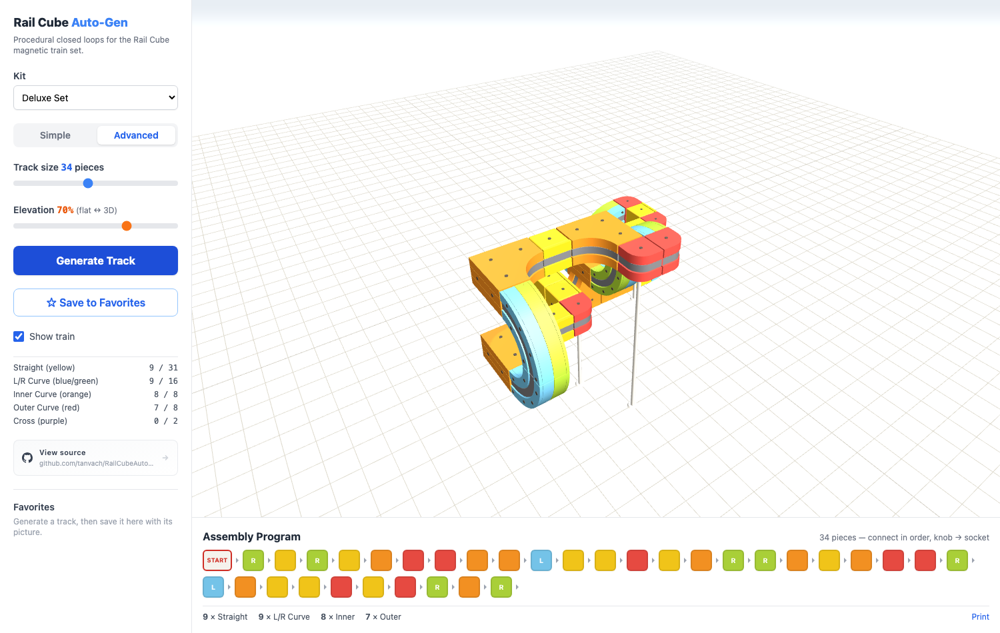
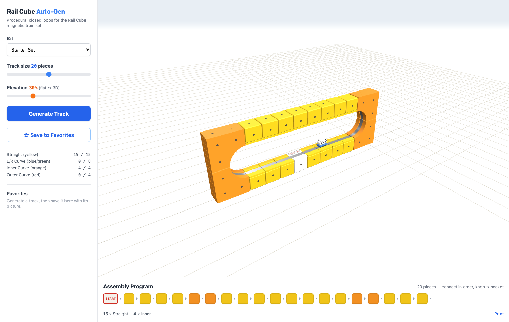
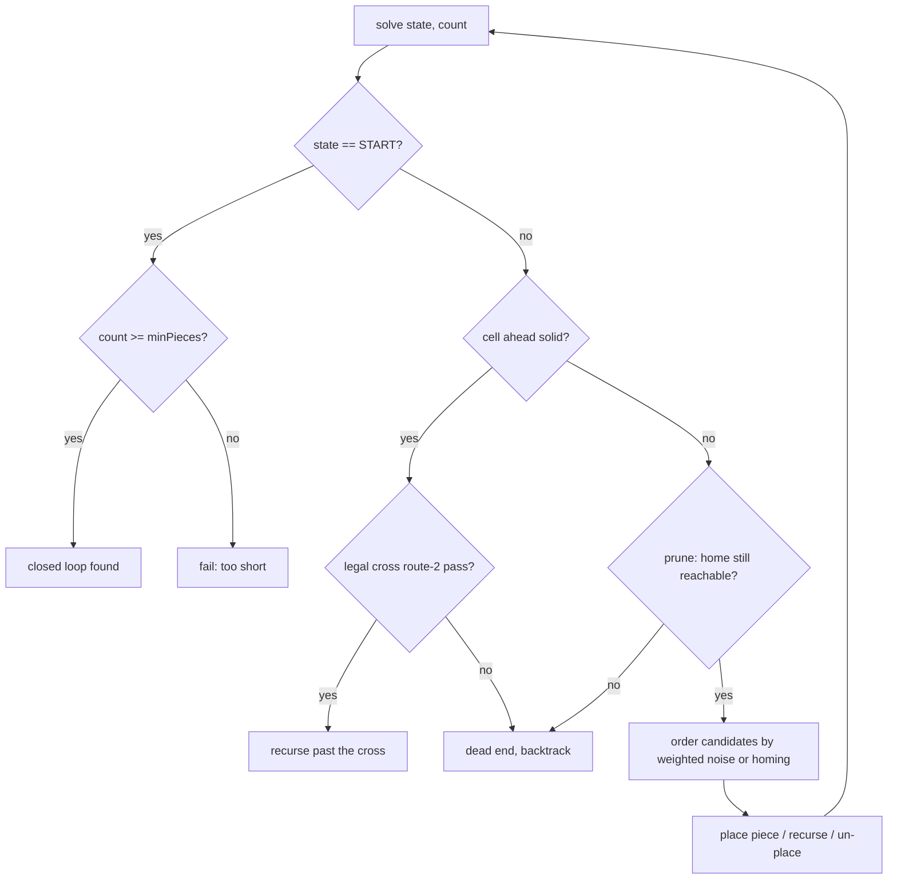

# How It Works

*How the [Rail Cube track generator](https://tanvach.github.io/RailCubeAutoGen/) finds closed
loops, and how it draws them. Written for people who build software. Undergrad math is
enough, and no Three.js or search-algorithm background is assumed.*

---

## Contents

1. [The toy and the problem](#1-the-toy-and-the-problem)
2. [What a track state has to remember](#2-what-a-track-state-has-to-remember)
3. [Pieces as rigid motions](#3-pieces-as-rigid-motions)
4. [What makes a track valid](#4-what-makes-a-track-valid)
5. [The solver: randomized backtracking](#5-the-solver-randomized-backtracking)
6. [Five heuristics](#6-five-heuristics)
7. [Interlude: how many tracks are there?](#7-interlude-how-many-tracks-are-there)
8. [Rendering: from integer cells to a lit scene](#8-rendering-from-integer-cells-to-a-lit-scene)
9. [How we know it's right](#9-how-we-know-its-right)
10. [Tradeoffs and future work](#10-tradeoffs-and-future-work)
11. [References](#11-references)

---

## 1. The toy and the problem

[Rail Cube](https://www.railcubetoys.com) (SunSmile レールキューブ) is a Japanese construction
toy. The pieces are plastic cubes with steel rail strips set into their faces, and the train
is a small battery-powered car with a magnet underneath. Because it holds on magnetically
rather than by gravity, it will happily ride up a wall, across a ceiling, and back down
again upside down. The manual comes with "programming practice" sheets: rows of colored
squares that a child reads left to right and turns into a physical build.



This project asks whether a computer can invent new courses from the pieces in the box.
Concretely the app has to do three things:

1. Find a sequence of pieces that leaves the white powered cube and comes back to it
   exactly, meaning the same cell, the same direction of travel and the same orientation,
   with no piece overlapping another or blocking the space the train needs.
2. Stay inside the physical inventory. You only own 8 curves.
3. Draw the result well enough that a child, or more realistically their parent, can build
   it from the picture and the color sequence.

That sounds like path-finding. It is closer to a self-avoiding polygon search in a state
space where the moves don't commute, which is a hard combinatorial problem. Most of what
follows is about the handful of heuristics that make it feel instant anyway. Everything runs
in the browser: the solver is dependency-free TypeScript in `src/core/` with no DOM and no
Three.js, and the renderer lives in `src/view/`.

## 2. What a track state has to remember

The first modeling decision is the one everything else hangs on. On an ordinary train set, a
track state is a position and a heading. That isn't enough here. The train can arrive at the
same cell going the same way while riding the floor, a wall, or a ceiling, and a different
set of pieces fits in each case.

So a track state is a frame: an integer grid cell plus two orthogonal unit vectors
(`src/core/pieces.ts`).

```ts
interface TrackState {
    cell: Vec3;  // integer grid cell
    dir:  Vec3;  // direction of travel        (axis-aligned unit vector)
    up:   Vec3;  // rail-face normal, pointing from the rail toward the train
}
```

`dir` has 6 possible values (±x, ±y, ±z) and `up` has to be perpendicular to it, which
leaves 4 choices, so each cell has 24 orientations. That number is not a coincidence. 24 is
the order of the rotation group of the cube, the chiral octahedral group, which is
isomorphic to S₄ because it permutes the cube's four body diagonals. A `(dir, up)` pair pins
down a full rotation because the third axis is forced: `right = dir × up`. The reachable
states are therefore

> ℤ³ × (rotation group of the cube), a discrete version of the rigid-motion group SE(3).

One practical note that saved me a lot of debugging. All the vector math is exact integer
arithmetic: cross products and negations of axis vectors, with no floats, no normalization
and no epsilon comparisons. The one wrinkle is that `-1 * 0` is `-0` in IEEE 754, and `-0`
fails a structural equality check against `0`, so the `Vec3` constructor normalizes `-0`
back to `0` (`src/core/vec.ts`). If you build something like this, you will hit that.

## 3. Pieces as rigid motions

Each piece type is a fixed rigid motion applied in the local frame. Enter it in state `s`
and it deterministically produces the cells it occupies and the exit state. The whole piece
catalog is one `switch` statement (`computePlacement` in `src/core/pieces.ts`).

| Piece | Color | Displacement (local) | Rotation | Cells |
| --- | --- | --- | --- | --- |
| Start / Straight | white / yellow | `+dir` | identity | 1 |
| Curve L/R | blue / green | `dir + 2*side` | 90° yaw about `up` | 4 (2×2 in the rail plane) |
| Inner curve | orange | `dir + 2*up` | 90° pitch: `dir -> up`, `up -> -dir` | 4 (2×2 in the dir/up plane) |
| Outer curve | red | `-up` | 90° pitch: `dir -> -up`, `up -> dir` | 1 |
| Cross | purple | `2*dir` | identity | 2 |

Two consequences of that table shape the entire solver.

The first is that closed loops are words that evaluate to the identity. A track is a
sequence of piece letters, and each letter multiplies the current state by a fixed group
element. The loop closes if and only if the product of all those motions is the identity,
meaning the same cell and the same orientation. In group-theory terms, tracks are walks on
something like a Cayley graph whose generators are the pieces, and valid loops are relators,
words equal to 1. There is a physical reading too. The orientation part has to multiply out
to the identity rotation, which is the discrete version of saying that parallel transport
around a closed curve has trivial holonomy. Ride the train around any legal loop and its up
vector comes back to where it started. The geometry guarantees it.

The second is that rotations don't commute, so there is no simple counting invariant. With
displacement alone you could say "the x components must sum to zero" and prune hard. Once
orientation is in the mix, an inner curve followed by a yaw differs from the yaw followed by
the inner curve, because S₄ is non-abelian. The only invariants left are the trivial ones,
net displacement zero and net rotation identity, and the solver's pruning (section 6)
exploits exactly those. Nothing deeper exists in closed form.

The `up` vector does real work in the piece definitions. Look at the red outer curve. It
occupies one cell, and its exit is `cell - up`, because the train wraps convexly around a
cube edge and continues down the far face of the same cube. Try expressing that with a
position and a heading. You can't.

## 4. What makes a track valid

Legal geometry is not the same as a legal build. `OccupancyGrid` (`src/core/grid.ts`)
enforces the physical constraints.

Solid cells never overlap other solids, which is the obvious one. Each piece also declares
swing cells, the empty space the train sweeps through while traversing it: one cell above a
straight, the carved region of a curve. A solid may never sit in anyone's swing cell, and no
swing cell may open inside a solid. Swing cells can be shared between pieces, though, and
that rule does more work than it appears to. Two rails can face each other across a single
empty cell, each claiming it as clearance. The manual's slotted-frame example below is
impossible to model without shareable swing cells, and that insight came straight from
staring at the printed manual. On top of those, every cell has to stay at `y >= 0`, and a
cross piece's perpendicular route 2 may be used at most once per loop.



*The manual's slotted frame. The train dives through a vertical slot one cell wide with rail
on both walls, and each wall piece claims the slot as its swing cell. That is legal, because
swing cells are shareable.*

The grid itself is two hash maps. The first implementation keyed them with strings like
`"3,0,-2"`, and profiling showed that building those keys dominated the solver's hot loop,
so cells are now packed into a single integer.

```ts
const B = 512;
const pack = (c: Vec3): number => (c.x + B) + ((c.y + B) << 10) + ((c.z + B) << 20);
```

Ten bits per coordinate, offset to stay positive. It's the same idea as a Morton code
without the interleaving, since we want cheap equality rather than spatial locality. That
made the collision check, the single most-executed operation in the search, roughly ten
times cheaper. In search code the constant factor on the innermost operation is the
performance model.

## 5. The solver: randomized backtracking

### Why not something fancier?

The obvious tools all miss, and it's worth saying why.

- A\* and Dijkstra find a shortest path to a goal. Shortest is exactly what we don't want,
  since a 4-piece loop is legal and boring. We want a loop of roughly a target length, with
  some variety, sampled differently each time you press the button.
- A SAT or CP solver could encode "closed loop, no overlap, inventory within budget", but
  the encoding over an unbounded ℤ³ is awkward, the solver ships megabytes of WASM, and you
  get one canonical answer rather than a stream of varied ones.
- Graph search with a visited set is unsound here, which is the subtle one. Whether a state
  is worth revisiting depends on everything placed so far, the occupancy grid and the
  remaining inventory, not just on the `(cell, dir, up)` tuple. Two visits to the same state
  are genuinely different search nodes. That is the formal reason this is backtracking over
  partial solutions rather than path-finding over states, the same reason nobody solves
  N-queens with Dijkstra.

So the solver (`src/core/generator.ts`) is a depth-first backtracker with the same skeleton
as a Sudoku or N-queens solver.

```
solve(state, pieceCount):
    if state == START_STATE:        return pieceCount >= minPieces      # loop closed
    if cell ahead is occupied:      only a cross route-2 pass can continue
    if provably can't return home:  return false                        # pruning, §6
    for each piece type, in weighted-random order:                      # ordering, §6
        place it; recurse; on failure, un-place it                      # backtrack
    return false
```

Placing and removing a piece are both O(cells) map operations, so backtracking is cheap. The
RNG is `mulberry32`, a tiny seedable generator, so the search is fully deterministic for a
given seed and settings. That makes failures reproducible and property tests meaningful
(section 9).

One deliberate exclusion: the generator never places cross pieces. A cross only earns its
place if the loop later re-crosses it through route 2, and a forward search has no way to
plan a rendezvous with its own future. Placed greedily, crosses behaved like over-wide
straights and cluttered the assembly program. Traversing a cross that is already on the
board still works, which is what replayed manual programs do. Section 10 sketches how a
future search could place them on purpose.

### The recursion in one diagram



## 6. Five heuristics

Plain backtracking is hopeless here. The branching factor is about 5 and useful tracks are
20 to 60 pieces deep, so the raw tree is astronomically large. Five heuristics bring the
common case down to tens of milliseconds. Each one is small on its own. They compound.

### 6.1 Admissible pruning (branch and bound)

At every node the solver asks whether getting home is still possible with the pieces it has
left. No single piece displaces the state by more than Manhattan distance 3, since curves
and inner curves move by `1 + 2`, so:

```ts
if (dist_home > remaining * 3) return false;
```

In A\* terms that is an admissible heuristic, a lower bound on remaining cost that never
overestimates. Here it isn't used to order the search, only to amputate subtrees that are
provably dead.

Position is not the only debt to pay off before a loop can close. Orientation is too, and it
gets its own exact bound. Only curves (a 90° yaw) and inner and outer curves (opposite 90°
pitches) change orientation, one step per piece, so the fewest pieces that could realign the
current `(dir, up)` with the start frame is its distance to the identity in the Cayley graph
of the cube's rotation group under those four generators. This is where the group theory
from section 3 becomes useful. The group has only 24 elements, so the whole metric is a
small table, computed by breadth-first search when the module loads.

| Distance home | Orientations | Example |
| --- | --- | --- |
| 0 | 1 | the start frame itself |
| 1 | 4 | one yaw or one pitch away |
| 2 | 10 | facing straight backwards, for instance |
| 3 | 8 | heading home but riding a side wall |
| 4 | 1 | heading home but hanging from the ceiling |

That last row is the odd one. `dir` exactly right with `up` exactly inverted is the single
hardest orientation in the game, because the move it wants is a roll about the direction of
travel, and no piece rolls. The solver has to synthesize one from four yaws and pitches. Any
branch whose orientation debt exceeds the remaining piece budget gets cut.

Now the confession. The first version of this bound was hand-derived, "wrong `dir` costs 1,
wrong `up` costs 2", and it was wrong in both directions at once. A single outer curve can
fix both axes in one move, so the true cost there is 1 where the bound charged 2, making it
inadmissible and quietly throwing away rare legal closings. Meanwhile the ceiling-hanging
case really costs 4, where the same bound charged 2 and pruned less than it could have. The
error survived every test run and went unnoticed until writing this document forced me to
actually prove admissibility. It is now an exact table with a property test that sweeps all
24 orientations (`src/core/generator.test.ts`). Writing the explanation is what found the
bug.

The distance bound has a second and sneakier benefit. It confines the search to a sphere of
radius `maxPieces * 3` around the origin, so the space is finite even though ℤ³ isn't.

### 6.2 Weighted-random candidate ordering

The elevation slider in the UI doesn't filter pieces, it reshapes a probability
distribution. Each candidate gets a weight, `1.1 - 0.4e` for curves and `0.08 + 2.2e` for
the vertical inner and outer pieces, and candidates are sorted by `rand() / weight`. Heavier
pieces tend to be tried first, and since the search is depth-first, tried first means
committed to first. Style falls out of ordering.

Sorting by `u/w` is a cheap cousin of the Gumbel-max trick. The exact way to sample an
ordering proportional to weights is to sort by `-ln(u)/w`, an exponential race, or
equivalently by `u^(1/w)`, which is Efraimidis and Spirakis weighted reservoir sampling. The
linear version is biased: with weights of 2 against 1 it puts the heavy item first about
three quarters of the time instead of two thirds. Since these weights only steer style and
never correctness, the cheapest formula wins.

Note the floor of `0.08` on the vertical pieces. Even at elevation 0 a wall climb stays
possible, just rare. Keeping a nonzero weight everywhere produces better surprises than a
hard filter does.

### 6.3 The homing phase

Random walks are bad at coming home. A symmetric walk wanders off and the piece budget runs
dry in mid-air. So the solver watches its slack, `remaining * 3 - dist_home`, and once slack
drops below 15 it drops weighted-random ordering and sorts candidates by how close their
exit lands to the start cube, with a little noise to break ties. The search changes
personality in mid-flight: an exploration phase gives the track its character, then a greedy
best-first homing phase lands the plane. Two-phase schemes like this are everywhere in
combinatorial optimization, and the transferable lesson is that a single ordering policy
rarely serves both halves of a constructive search.

### 6.4 Restarts and the heavy tail

The biggest speedup came from the least intuitive change. Backtracking runtimes on
constraint problems are famously heavy-tailed, which Gomes, Selman and Kautz studied in the
late 1990s. Most random seeds close a loop almost immediately, while a small fraction commit
early to a doomed region and then burn any budget you hand them. The variance is extreme
enough that rare disasters dominate the mean.

The cure isn't a smarter search. It's giving up early and often. `generateTrack` runs a
restart schedule with escalating node budgets.

| Round | Attempts | Node budget each |
| --- | --- | --- |
| 1 | 40 | 15,000 |
| 2 | 20 | 60,000 |
| 3 | 8 | 250,000 |
| 4 | 6 | 1,000,000 |

Forty cheap lottery tickets before any expensive one. That is the practical shape of the
Luby, Sinclair and Zuckerman result, which proves that when runtime distributions are
unknown and heavy-tailed a universal restart schedule comes within a log factor of the best
possible strategy, and that any restart policy beats no restart policy by unbounded factors.
Measured on my machine with `npx vite-node scripts/bench-generator.ts`, 10 seeds per
setting:

```
starter balanced (21 pieces, 45% elevation)   median 30ms    p90 61ms    max 201ms
starter wild     (32 pieces, 90% elevation)   median 163ms   p90 485ms   max 597ms
deluxe twisty    (48 pieces, 68% elevation)   median 230ms   p90 429ms   max 5.2s
deluxe wild      (66 pieces, 90% elevation)   median 2.0s    p90 5.3s    4/10 fail raw
```

Before the schedule, and before the integer grid keys of section 4, those medians sat in the
tens of seconds. The max to median ratios are still 5 to 20 times even with restarts, so the
tail shrank but never went away.

### 6.5 Graceful relaxation

That `4/10 fail` row never reaches the user. The solver runs in a Web Worker
(`src/core/generator.worker.ts`), and if the full schedule finishes without closing a loop,
the worker softens the request once, dropping the minimum length to 60% and elevation to
80%, then runs again and flags the result so the UI can say what happened ("Tough settings,
relaxed slightly"). It's an availability-over-exactness call, the same posture as a service
that serves a slightly stale cache entry instead of a 500. For a toy-track generator, a good
track now beats the requested track never. The flag matters though, because degrading
silently would misrepresent what the user got.

## 7. Interlude: how many tracks are there?

A closed track that never intersects itself is, to a combinatorialist, a self-avoiding
polygon on a lattice. A decorated one, since our steps are pieces carrying orientation
rather than plain unit edges. Self-avoiding walks and polygons look innocent and hide a lot
of open problems.

- Nobody knows a closed-form count of self-avoiding walks of length *n*, even on the 2D
  square lattice. The count grows like μⁿ, and the connective constant μ isn't known exactly
  for ℤ² or ℤ³.
- One exact result stands out. Duminil-Copin and Smirnov proved in 2012 that the honeycomb
  lattice's connective constant is exactly √(2+√2), work that fed into a Fields Medal. That
  is the state of the art for counting the kind of thing this app generates.
- Sampling these polygons uniformly at random is its own research area, full of pivot
  algorithms and Markov chains with delicate mixing-time analysis, because naive growth
  processes like ours oversample tame shapes.

None of that machinery is needed here, but it does calibrate expectations. There was no
clever closed-form enumeration waiting to be found, a search-based generator is the honest
approach, and the tracks this app produces are a biased sample of the space (see section
10). It also explains why the search feels hard. It is hard, in a way mathematicians have
measured.

## 8. Rendering: from integer cells to a lit scene

The renderer's job is to make the solver's integer world buildable by eye, and its
architecture follows one rule: the solver's output is the single source of geometric truth.
The renderer never re-derives where a piece sits or which way it faces, it consumes
`PiecePlacement` verbatim. When rendering and physics share no duplicated math, they can't
disagree.

### 8.1 One mesh, twenty-four orientations

Every piece type is modeled once, in a canonical local frame with the entry cell at the
origin, travel along +x and the rail normal along +y (`src/view/meshes.ts`). Placing it in
the world is a change of basis.

```ts
const placementMatrix = (p: PiecePlacement): THREE.Matrix4 => {
    const d = p.entry.dir, n = p.entry.up;
    const r = cross(d, n); // third axis is forced, same fact as section 2
    return new THREE.Matrix4()
        .makeBasis(vec(d), vec(n), vec(r))
        .setPosition(p.entry.cell.x, p.entry.cell.y, p.entry.cell.z);
};
```

The columns of a rotation matrix are the images of the basis vectors, so the `(dir, up)`
pair from the solver drops straight into `makeBasis` and all 24 orientations come free.
There are no per-orientation meshes and no Euler angle bookkeeping to drift out of sync.

Two small tricks do a lot of the visual work. Chained same-color pieces used to fuse into
one continuous plastic blob, so each mesh is now scaled to 98% about its own footprint
center, which opens a hairline seam at every joint and lets a builder count individual
cubes. And every flat marking, meaning support holes and connector sockets, goes through a
single `faceDisc` helper that stands the decal a fixed 0.012 units proud of its face. Two
exactly coplanar surfaces have identical depth-buffer values, and which one wins the depth
test varies per pixel and per frame. That shimmer is z-fighting, and the durable fix is a
rule ("decals are never coplanar, ever") rather than nudging offsets one bug report at a
time.

### 8.2 Animating the train: arc length and moving frames

The train should glide at constant speed and bank smoothly through wall climbs. Both are
small differential-geometry problems.

Constant speed comes from re-parameterizing the path. Each piece contributes rail samples in
its local frame, two points for a straight and 14 arc segments for a curve, transformed to
world space by the same `placementMatrix`. Interpolating by sample index would sprint
through long segments and crawl through short ones, so the samples are re-parameterized by
cumulative arc length: to place the train at distance *s*, find the segment containing *s*
and interpolate inside it. It's the discrete version of the reparameterization by arc length
that every differential geometry course opens with.

Orientation comes from the rail samples, which carry `up` normals taken from the solver's
model. Each animation frame derives the train's forward vector by differencing positions and
its up vector by interpolating sample normals, then squares the pair up with cross products,
`right = fwd × up` followed by `trueUp = right × fwd`. That is Gram-Schmidt orthonormalization
in three dimensions. Interpolating the up vector smoothly along the path is a poor man's
parallel transport frame, which is the standard fix for the twist singularities a Frenet
frame produces on straight segments where curvature, and therefore the Frenet normal,
vanishes.

Pushing `up` all the way from the solver into the animation pays off here: wall riding and
ceiling hanging need no special cases anywhere. The train has no idea it's upside down.

### 8.3 Supports, camera, and light

Three smaller systems, each one a place where I picked a heuristic over a simulation.

Support pillars (`addSupports` in `src/view/scene.ts`) would need a model of magnet strength
to do properly. Instead a piece counts as anchored if it touches the ground or rests on
another piece, and only every third consecutive floating piece gets a pillar, since the
magnets really do hold short cantilevers on the physical toy. Pillars also have to drop
through empty columns and never through a swing cell, or the train would hit them. That is
the solver's clearance model doing double duty in the renderer.

Camera framing has to fit an arbitrarily shaped track after each generation. For a candidate
view direction, project the bounding-box corners into camera space; each corner then demands
a minimum distance of `a + max(|h|/tan(fovH/2), |v|/tan(fovV/2))` to sit inside both frustum
planes, and the camera takes the largest demand. On portrait phone screens the view
direction itself gets steeper, because a flat track seen edge-on through a tall narrow
window wastes almost every pixel.

The fill light exists because sun-plus-ambient looked great until you orbited to the far
side of a track, where every surface facing the camera sat in the sun's shade. The fix is a
directional fill rigged to the camera, re-aimed every frame from over the viewer's left
shoulder, kept far enough off-axis to preserve shading instead of flattening everything like
a headlamp. The neat part is why it needs no dimming logic on the sunny side. Sunlit faces
already render near the top of the displayable range, so the extra light mostly disappears
into sRGB's soft clip, while shaded faces sit in the steep part of the gamma curve and gain
the most. The transfer function does the compositing for you.

## 9. How we know it's right

This project is tested harder than a hobby project probably deserves, because the failure
mode is quiet and embarrassing: a kid-facing app that emits a track nobody can build.

Two courses from the printed Japanese manual, the slotted frame and the S-course, are
transcribed piece by piece in `src/core/examples.ts` and replayed through the real placement
code in tests, where they have to close and stay collision-free. When the frame example
failed to close during development it turned out to be a real transcription error on my
part, so the suite audits the manual and the model against each other.

Generated tracks are never trusted. Every one gets re-validated from scratch by an
independent checker covering placement legality, chain continuity, closure, the floor
constraint and inventory limits, across many random seeds. Writing the generator and the
validator separately and then pointing them at each other is the cheapest strong correctness
argument I know. Determinism helps here too: same seed, same track, so any property-test
failure replays in a debugger.

Rendering bugs don't show up in unit tests, so a Playwright script
(`scripts/screenshot.mjs`) screenshots the manual example, generated tracks, the mobile
layout and the print view against a production build. There is also a benchmark
(`scripts/bench-generator.ts`), which is why the numbers in section 6.4 are one command away
from being checked rather than something you have to take on faith.

## 10. Tradeoffs and future work

Every decision above traded something away. Here is the ledger, roughly ordered by how
interesting the gap is.

The sampler is biased. Restarted weighted DFS returns the first loop it finds, so the output
distribution over valid tracks is unknown and certainly not uniform, since greedy growth
oversamples shapes that are easy to close. The literature's answer is MCMC over the polygon
space with pivot-style moves: cut a track, rotate a section, re-validate. That would also
enable a feature I want anyway, which is mutating an existing track slightly instead of
regenerating from scratch.

Cross pieces are never generated (section 5). Placing one on purpose means planning a
rendezvous with your own future, which fits bidirectional search nicely: grow two arcs from
the start and stitch them where they meet, using the cross as the splice. Declaring the
crossing cell a waypoint constraint would work too. This is the clearest open problem in the
project and probably the most fun one.

The two lower bounds don't talk to each other. Position debt and orientation debt (section
6.1) are each exact on their own, but the solver combines them with a `max`, and the joint
truth can exceed both. A state might need 3 pieces to fix position and 3 to fix orientation
yet 5 to settle both at once, because the pieces that rotate you also move you. The
heuristic-search answer is a pattern database (Culberson and Schaeffer): precompute the true
minimum piece count from every combination of relative cell and orientation inside the
reachable sphere, ignoring collisions. The space is small enough that this is a weekend
project, and it would prune strictly harder.

There is no memoization, for the reason in section 5, but symmetry is still unexploited. The
state space has a 24-fold rotational symmetry, 48-fold with reflections, so canonicalizing
partial tracks would shrink an exhaustive count by roughly that factor. Exhaustively
counting all valid loops for small piece budgets looks very feasible and would make a good
appendix. Nobody currently knows how many starter-set tracks exist.

Length and elevation are guided rather than guaranteed. The weights shape tendencies, and
the relaxation fallback in section 6.5 can shorten a request outright. Hard constraint
satisfaction would buy precision at the cost of failures and latency, which is the wrong
trade for a toy.

Supports are theater. Pillar placement is a visual heuristic (section 8.3), not statics. A
real model would check magnetic joint torque against cantilever moments, which would be
worth having, because the physical toy does sag on long unsupported spans.

There is rendering headroom left. Every piece is an independent mesh group, so a 66-piece
deluxe track costs a few hundred draw calls. That's fine today. `InstancedMesh`, one draw
call per piece type, is the standard next step and would start to matter for something like
a gallery view of 50 saved tracks.

## 11. References

- N. Madras and G. Slade, *The Self-Avoiding Walk* (Birkhäuser). The standard reference for
  the combinatorics in section 7.
- H. Duminil-Copin and S. Smirnov, *The connective constant of the honeycomb lattice equals
  √(2+√2)*, Annals of Mathematics 175 (2012).
- C. Gomes, B. Selman and H. Kautz, *Heavy-tailed phenomena in satisfiability and constraint
  satisfaction problems*, Journal of Automated Reasoning 24 (2000). Why restarts work.
- M. Luby, A. Sinclair and D. Zuckerman, *Optimal speedup of Las Vegas algorithms*,
  Information Processing Letters 47 (1993). The universal restart schedule.
- P. Efraimidis and P. Spirakis, *Weighted random sampling with a reservoir*, Information
  Processing Letters 97 (2006). The exact version of the ordering trick in section 6.2.
- J. Culberson and J. Schaeffer, *Pattern databases*, Computational Intelligence 14 (1998).
  The joint lower bound proposed in section 10.
- Russell and Norvig, *Artificial Intelligence: A Modern Approach*. The chapters on
  backtracking CSPs and admissible heuristics, if sections 5 and 6 are new to you.

---

*Found an error, or solved the cross-piece problem? Open an issue. The whole model is about
500 lines of dependency-free TypeScript in [`src/core/`](../src/core), and it's a fun
codebase to poke at.*
